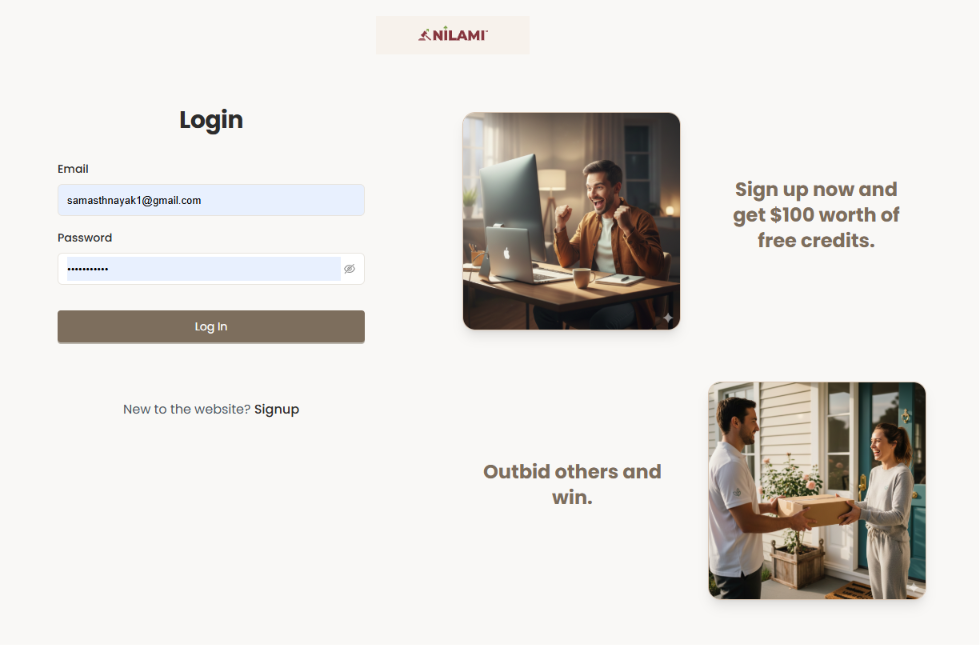
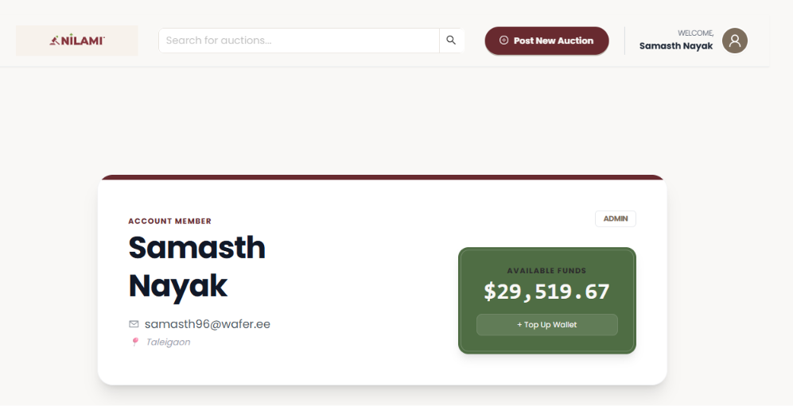
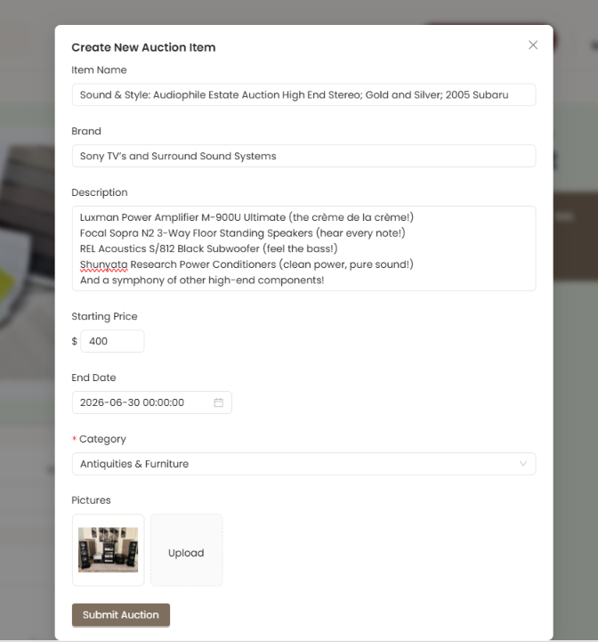
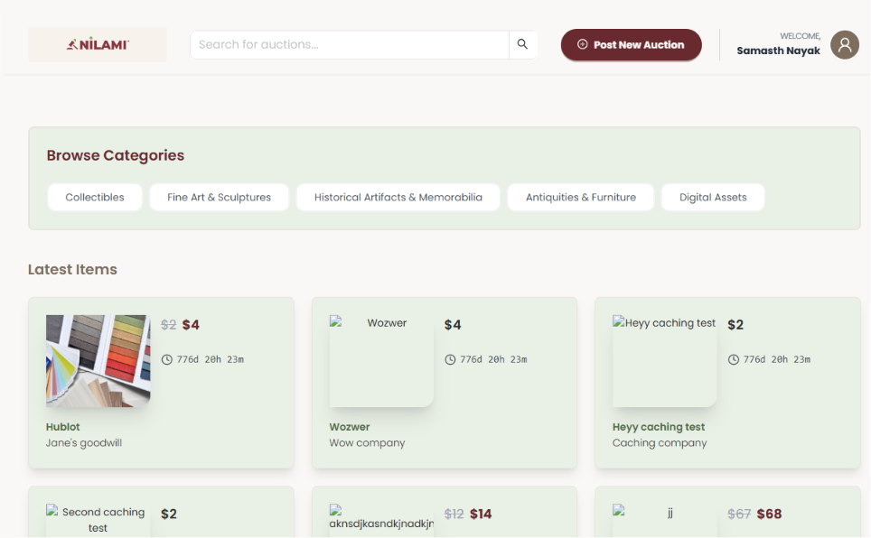
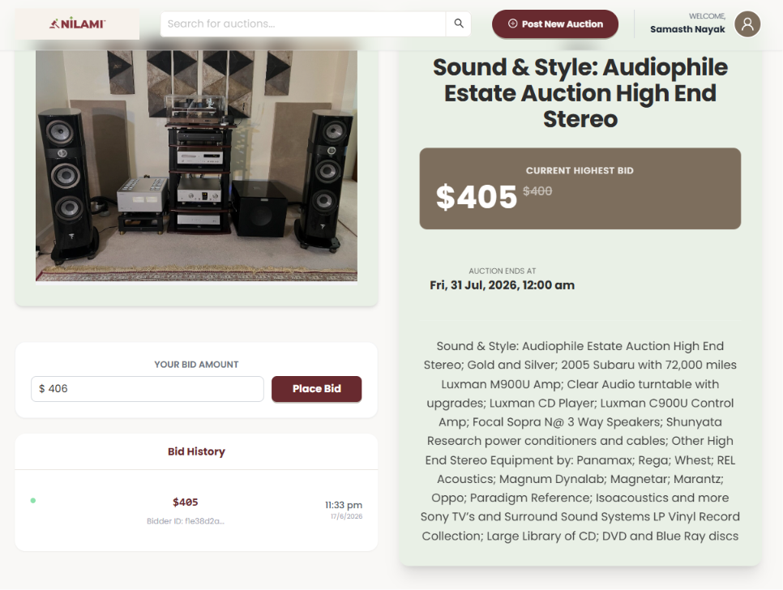
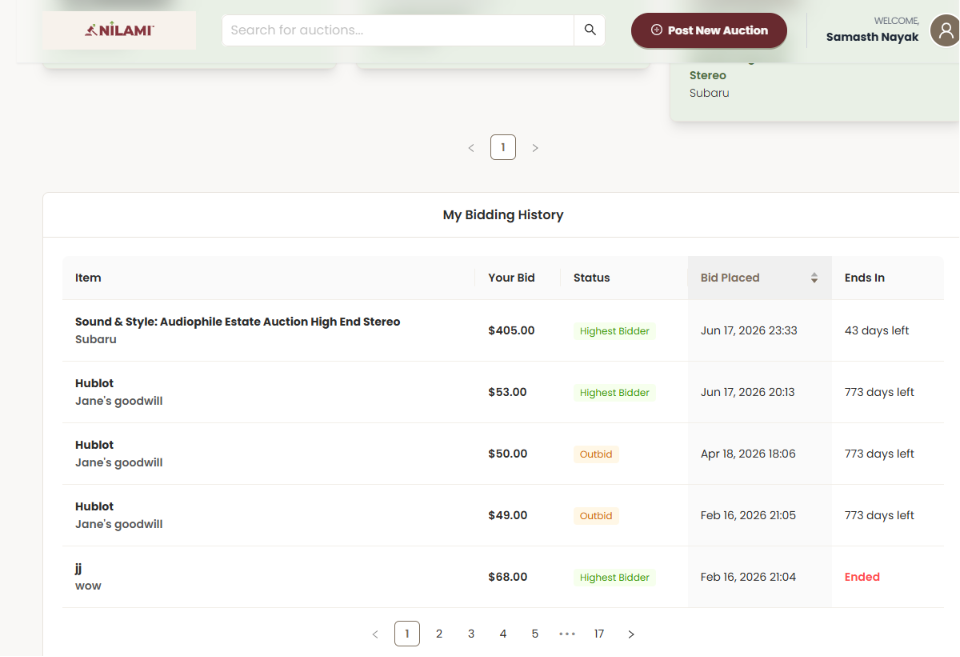
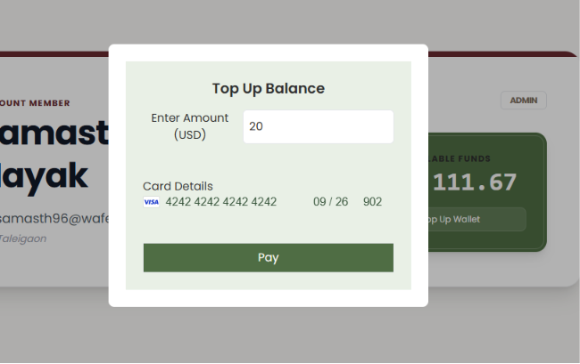
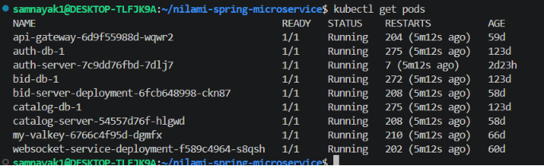

# Nilami

Nilami is a microservices-based auction platform that allows users to bid on items while giving administrators the tools to list and manage sales.

**Tech Stack:**
- **Backend:** Spring Boot, Spring Data JPA
- **Database Migration:** Flyway
- **Containerization:** Docker
- **Orchestration:** Kubernetes (k3s)
- **Security & Identity:** AWS Cognito
- **File Storage:** AWS S3
- **Secret Management:** HashiCorp Vault
- **Caching:** Valkey/Redis

**Client:** [nilami-dashboard](https://github.com/samnayak1/nilami-dashboard)

---

## Features

### Authentication & Account Management


*User login page with sign-up option and free credits promotion*


*User account dashboard showing member details and available wallet balance*

### Auction Management

#### Create New Auction (Admin)


*Admin interface for creating and listing new auction items with details, pricing, and categories*

#### Browse & Browse Auctions


*Browse auctions by category with latest items displayed*

#### Item Details & Bidding


*Item detail page showing current highest bid, auction end time, and bidding interface*

### Bidding History


*View all past and current bids with bid amount, status, and auction timeline*

### Payment


*Wallet top-up interface with Stripe integration for card payments*

---

## Prerequisites

- Docker
- k3s
- Helm

---

## Installation

Run these in order — each step assumes the previous ones are complete.

### 1. K3s (Kubernetes)

```bash
# Install K3s
curl -sfL https://get.k3s.io | sh -s - --write-kubeconfig-mode=644

# Verify installation
sudo kubectl get nodes

# Configure kubectl
mkdir -p ~/.kube
sudo cp /etc/rancher/k3s/k3s.yaml ~/.kube/config
sudo chown $USER:$USER ~/.kube/config
export KUBECONFIG=~/.kube/config

# Manage the K3s service
sudo systemctl start k3s
sudo systemctl stop k3s
sudo systemctl status k3s
```


*Checking running pods in the Kubernetes cluster*

### 2. HashiCorp Vault

```bash
helm repo add hashicorp https://helm.releases.hashicorp.com
helm repo update
helm install vault hashicorp/vault -n vault --create-namespace -f vault-values.yaml

# Access the Vault UI
kubectl port-forward -n vault svc/vault 8200:8200
```

### 3. External Secrets Operator

```bash
helm repo add external-secrets https://charts.external-secrets.io
helm install external-secrets external-secrets/external-secrets \
  --namespace external-secrets --create-namespace
```

### 4. CloudNativePG Operator

```bash
kubectl apply --server-side -f \
  https://raw.githubusercontent.com/cloudnative-pg/cloudnative-pg/release-1.28/releases/cnpg-1.28.0.yaml
```

### 5. NGINX Ingress Controller

```bash
kubectl apply -f https://raw.githubusercontent.com/kubernetes/ingress-nginx/main/deploy/static/provider/kind/deploy.yaml
```

### 6. cert-manager

```bash
kubectl apply -f https://github.com/cert-manager/cert-manager/releases/download/v1.13.0/cert-manager.yaml
```

Wait until all three pods are running:

```bash
kubectl get pods -n cert-manager
```

### 7. Valkey (Redis)

```bash
helm repo add valkey https://valkey.io/valkey-helm/
helm repo update
helm install my-valkey valkey/valkey -f catalogservice/src/k8/valkey-values.yaml
```

---

## Configuration

### Vault: Initialize and Unseal

```bash
# Shell into the Vault pod
kubectl exec -n vault -it vault-0 -- sh

# Initialize
vault operator init

# Check status
kubectl exec -n vault vault-0 -- vault status

# Unseal (run with different keys until unsealed)
kubectl exec -n vault vault-0 -- vault operator unseal <key1>
kubectl exec -n vault vault-0 -- vault operator unseal <key2>
```

### Vault: Policy and Token

```bash
# Shell into Vault and log in
kubectl exec -n vault -it vault-0 -- sh
vault login <ROOT_TOKEN>

# Copy and apply policy
kubectl cp vault-read.hcl vault/vault-0:/tmp/vault-read.hcl
kubectl exec -it -n vault vault-0 -- vault policy write vault-read /tmp/vault-read.hcl

# Create Kubernetes secret with Vault token
kubectl create secret generic vault-token -n external-secrets --from-literal=token=<root-token>
```

### Vault: Create the ClusterSecretStore

Point External Secrets at Vault. Run this after the `vault-token` secret exists:

```bash
kubectl apply -f vault-secretstore.yaml
```

### Vault: Verify

```bash
kubectl describe externalsecret <secret-name> -n <namespace>
kubectl describe ClusterSecretStore vault-backend
kubectl get externalsecrets -A
kubectl rollout restart deployment external-secrets -n external-secrets
```

### Database: Connect

```bash
# Port-forward
kubectl port-forward svc/catalog-db-rw 5432:5432 &

# List databases
kubectl exec -it catalog-db-1 -- psql -U postgres -c "\l"

# Bash into pod
kubectl exec -it catalog-db-1 -- bash

# Direct connection
psql -h localhost -p 5432 -U <user> -d <database>
```

### Database: Patch Persistent Volume Reclaim Policy


For the CNPG clusters, the default means that if you kubectl delete a cluster the volume is deleted too.


Patching to Retain makes that survivable — the volume sticks around and you can recover from it.

```bash
kubectl patch pv <pv-id> -p '{"spec":{"persistentVolumeReclaimPolicy":"Retain"}}'
```

### Ingress: Test

```bash
curl -v "http://app.local/ws/socket.io/?EIO=4&transport=polling"
```

### Ingress: HTTPS with Let's Encrypt (cert-manager)

This sets up automatic TLS for `server.nilami.click` using cert-manager and Let's Encrypt via the HTTP-01 challenge. Port 80 must be open for the challenge to work. Once done, the backend will be reachable at `https://server.nilami.click`.

The `letsencrypt-prod` ClusterIssuer is part of the api-gateway prod overlay, so applying that overlay creates it:

```bash
kubectl apply -k api-gateway/src/k8/overlays/prod
```

Or apply the issuer on its own:

```bash
kubectl apply -f api-gateway/src/k8/overlays/prod/issuer.yaml
```

> **Note:** the issuer's HTTP-01 solver targets ingress class `traefik` (k3s's bundled controller). If you installed the NGINX ingress controller above and want it to serve the challenge, change `solvers[0].http01.ingress.class` in `issuer.yaml` to `nginx`. Also set a real `spec.acme.email` — it is currently `your-email@example.com`.

### Payment Integration (Stripe)

```bash
# Listen for events in development
stripe listen \
  --events payment_intent.succeeded,payment_intent.payment_failed \
  --forward-to http://app.local/api/v1/auth/payment/webhook

# Create a test payment intent
stripe payment_intents create \
  -d amount=2000 \
  -d currency=usd \
  -d "metadata[userId]=user123" \
  -d "automatic_payment_methods[enabled]=true" \
  -d "automatic_payment_methods[allow_redirects]=never"

# Confirm with a test card
stripe payment_intents confirm <payment_intent_id> --payment-method=pm_card_visa
```

---

## Local Development

### Image Management

```bash
# Build
docker build -t <imagename>:latest .

# Tag
docker tag <imagename>:latest <dockerhub-username>/<imagename>:<version>

# Push
docker push <dockerhub-username>/<imagename>:<version>
```

### API Documentation (Swagger)

Port-forward the API gateway, then open the Swagger UI:

```bash
kubectl port-forward svc/api-gateway 8084:8084
```

Visit: `http://localhost:8084/swagger-ui.html`

---

## Troubleshooting & Operations

### Quick Reference

| Task | Command |
|------|---------|
| Shell into a pod | `kubectl exec -it -n <namespace> <pod> -- bash` |
| Connect to database | `psql -h localhost -p 5432 -U <user> -d <database>` |
| Port-forward a service | `kubectl port-forward svc/<service> <local>:<remote>` |
| Stream logs | `kubectl logs -f <pod> -n <namespace>` |
| Get pod status | `kubectl get pods -n <namespace>` |
| Describe a resource | `kubectl describe <type> <name> -n <namespace>` |
| Watch pods | `kubectl get pods -w` |
| Restart a deployment | `kubectl rollout restart deployment/<name>` |
| Scale down a deployment | `kubectl scale deployment <name> --replicas=0` |
| View resource usage | `kubectl top pods --all-namespaces --sort-by=memory` |
| Clear kubectl cache | `rm -rf ~/.kube/cache ~/.kube/http-cache` |
